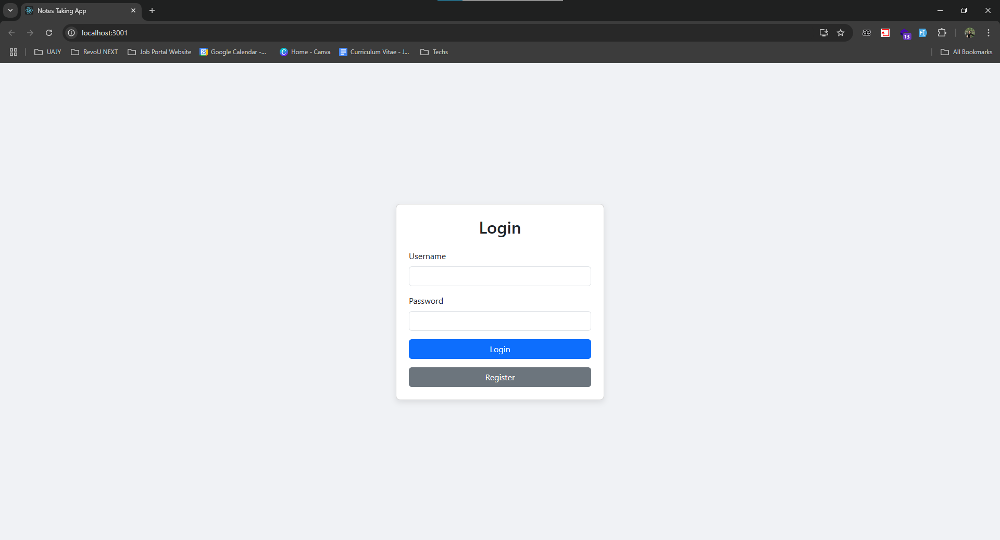

# SAM Element Full-stack coding challenge

**This project is a simple, secure note-taking application with a full-stack implementation. The frontend is built using ReactJS, and the backend is powered by ExpressJS with TypeScript. MySQL is used for data storage, with Prisma as the ORM for seamless database interaction.**

## Features

- User Authentication & Authorization: Secure login and registration functionalities ensure that each user can access only their own notes.
- CRUD Operations: Users can create, update, delete, and search through their personal notes.
- Profile Management: Users have the option to update their profile information.
- Note Privacy: Each user's notes are isolated, ensuring privacy and data security.

This project demonstrates a complete setup for a user-centric application, focusing on security, scalability, and functionality.

## Screenshots

### Login Page

### Register Page

### Main Pages

### User Profile Modal

### Add New Note Modal

### Note Detail Modal

